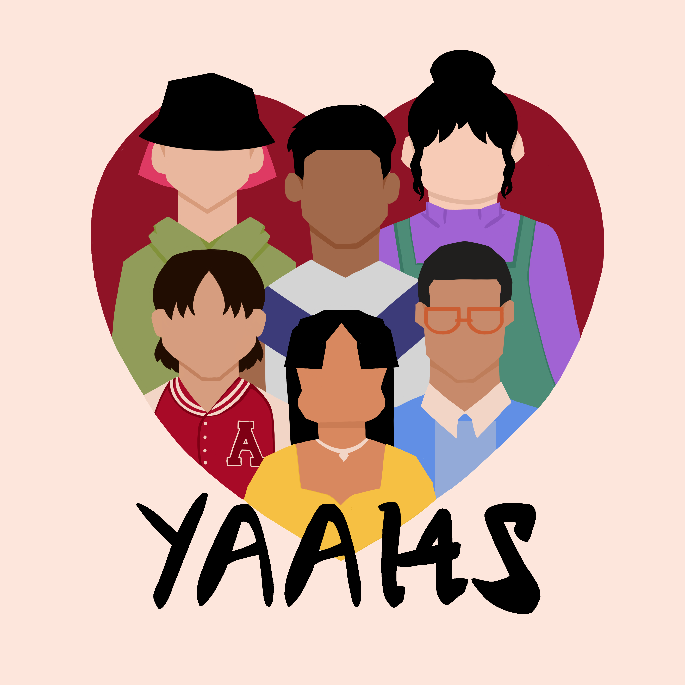

In March 2020, a man in Georgia shot and killed eight Asian Americans. Although the attack was not immediately deemed "racially motivated," it was hard for me to believe it was anything else. These murders were the most violent manifestation, but not the first, of anti-Asian rhetoric that circulated around the United States since the beginning of the pandemic. Elderly Asians were victims of physical and verbal attacks ^[https://www.washingtonpost.com/nation/2021/02/09/attacks-asian-american-elderly-/], Donald Trump called COVID-19 the "kung flu ^[https://www.theguardian.com/us-news/2020/jun/20/trump-covid-19-kung-flu-racist-language];" the list goes on. 

There have been several efforts to quantify the level of violence against Asian communities in the United States like the <a href = "https://stopasianhate.info">Stop Asian Hate </a> organization. Although this project brings awareness to the issue, colleagues and I were concerned that the experiences of young people were not included in these statistics. To address the data gap on Asian American youth and adolescents, we created the <a href = "https://yaahsteam.org">**Young Asian American Health Survey (YAAHS)**</a>. 

### OUR WHY

We lack rigorous data on how young Asian Americans are managing amid rising anti-Asian racism during the COVID-19 pandemic. Their mental health and well-being are missing from the national dialogue to #StopAsianHate.

### OUR APPROACH

YAAHS is led by a diverse team of Asian American researchers and professionals, also driven by Asian American youth from the pilot and throughout the project.

### OUR GOAL

- Arm policymakers, health professionals, and the Asian American community with data to support adolescents and youth during this crisis.

- Facilitate forward-looking, action-oriented conversations, policies, and partnerships across communities.

- Inform future research.

Information about our methods, data, and findings are shared on our <a href = "https://yaahsteam.org">website</a>. 

