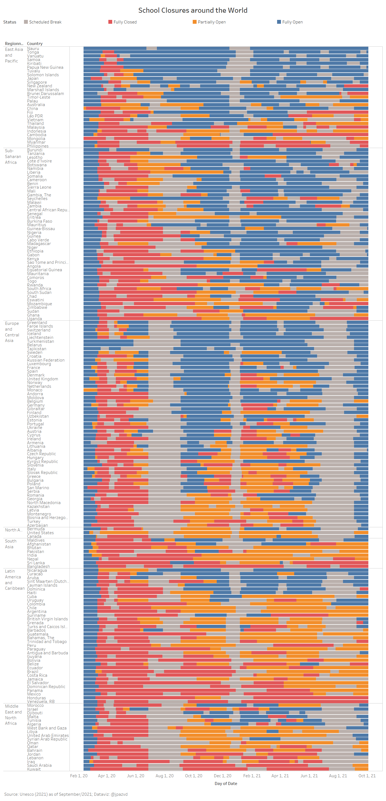

```{r setup, include=FALSE}
knitr::opts_chunk$set(echo = FALSE)
```

# About

COVID-19 school closures disrupted the education of nearly 1.6 billion learners around the world. Early in the pandemic, experts speculated that girls would be disproportionately affected, and hypothesized increases in learning loss, child marriage, adolescent pregnancy, and gender-based violence.[^1] This report uses evidence gathered by the [Population Council](https://www.popcouncil.org) to study the gendered impacts on education, health, and well-being of adolescents around the world, with a particular focus on low-and-middle income countries.

[^1]: [Opinion: Don't let girls' education be another casualty of the coronavirus \| Global Partnership for Education](https://www.globalpartnership.org/news/opinion-dont-let-girls-education-be-another-casualty-coronavirus)

Read the full report: [When schools shut](https://unesdoc.unesco.org/ark:/48223/pf0000379270)



# Key Findings

### Effects

-   Girls faced significant barriers to accessing remote education for a variety of reasons. In many countries, girls took on additional household chores such as taking care of siblings, cooking, or cleaning. These responsibilities took away time for studying or interfered with broadcast schedules. In some cases, boys faced similar difficulties due to income-generating activities. Girls also were less likely to report owing a device like a mobile phone, which they could use for studying.

-   Both boys and girls reported poorer mental health including symptoms of anxiety and depression. While girls tended to be more likely to report negative mental health effects, boys were not immune. In particular, boys in refugee and crisis settings reported greater exposure to violence as tensions rose in their communities.

-   Anecdotal evidence suggests increases in child marriage, adolescent pregnancy and gender-based violence, but concrete data is not yet available.

### Responses

-   Initial government responses primarily focused on delivering education to as many children as possible through multiple channels. But policies rarely mentioned actionable steps to mitigate challenges girls or other vulnerable populations (such as those with disabilities) would face to accessing remote learning.

-   Family and community engagement programs were common innovations to understand and meet the needs of hard-to-reach learners.

-   Several countries and organizations developed campaigns for re-enrollment, encouraging girls' education, and preventing gender-based violence. As the world begins to move forward and more children are able to return to school, programs and policies will be needed to address learning loss as well as social-emotional learning, mental health, and social stigma and discrimination against girls who may have gotten pregnant.
