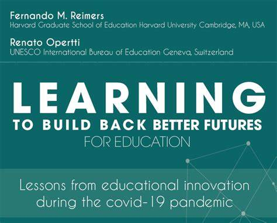

# About

**From the publisher:**

This book attempts to contribute to the development of operational strategies for change in education that will help prepare students for the future, while addressing the impact of the COVID-19 pandemic and making education systems more resilient to future disruption. Drawing on the goals and extensive work of the [Global Education Innovation Initiative](https://globaled.gse.harvard.edu/) at the Harvard Graduate School of Education in advancing knowledge on how to transform public education, the aspirations of the [Hybrid Education, Learning and Assessment (HELA)](http://www.ibe.unesco.org/en/news/hybrid-education-learning-and-assessment-hela) initiative of the UNESCO International Bureau of Education (IBE) and the inspiring vision of [UNESCO's Futures of Education](https://unesdoc.unesco.org/ark:/48223/pf0000379707) initiative, we set out to identify and study examples of educational innovation that emerged during the pandemic and that present pathways for transformation.

Download the publication: [Learning to Build Better Futures for Education](http://www.ibe.unesco.org/en/news/learning-build-back-better-futures-education-lessons-educational-innovation-during-covid-19)

# Play Well

I am the author of Chapter 19 about the innovation Play Well. I was introduced to Play Well while working with the [Population Council](https://www.popcouncil.org/) on the report [When Schools Shut](http://delaniehonda.rbind.io/projects/2021-10-13-gendered-effects-of-covid-19-school-closures/).

I wanted to share Play Well in this chapter because it sought to address three major issues I saw in low-and-middle-income countries during the pandemic:

1.  Need for low-tech resources. Many students and families lacked access to the infrastructure or devices needed to learn remotely during the pandemic. Play Well was designed with these types of learners in mind.

2.  Supporting socio-emotional learning (SEL) skills. During interviews with global education and gender actors for When Schools Shut, some mentioned the need to incorporate SEL skills as well as academics. While many programs (understandably) focused on numeracy and literacy, lessons which help students build self-awareness and strong relationships were equally important to help children be resilient when faced with a crisis like COVID-19.

3.  Reaching marginalized populations. When Schools Shut focused on gender and in particular, girls' challenges when accessing remote learning. But throughout our research, I came across similar (and often intersecting) challenges for other marginalized populations. In particular, learners with disabilities, those living in conflict or crisis-affected regions, and those in rural areas were not able to access distance learning materials. Play Well specifically targets refugee and migrant children, a population which faced a "double crisis."

I am deeply grateful to members of the Play Well team at the [International Rescue Committee](https://www.rescue.org/) who generously shared their time and information about the program. I am also thankful to [Professor Fernando Reimers](https://www.gse.harvard.edu/faculty/fernando-reimers) at the Harvard Graduate School of Education for extending the opportunity to collaborate with him and colleagues on this publication.

**Abstract**: The COVID-19 pandemic has affected millions of students and brought the discussion of the importance of social and emotional learning (SEL) to the forefront, as educators, community leaders and caregivers seek to find ways to support young people's academic development and well-being. Children affected by disaster, conflict and displacement are at a particular disadvantage as they are less likely to re-enrol in schools once they reopen and are often at the greatest risk of the long-term consequences of learning disruption. This situation can contribute to negative impacts on physical and mental well-being, as well as reduced educational attainment. Quality education opportunities, including SEL skills, is one tool that can be used to mitigate these negative effects and support children's academic progress and healthy development. This chapter discusses the implementation, lessons learned and future outlook of the Play Well programme, implemented in Colombia by the International Rescue Committee (IRC), with funding from the Lego Foundation. Play Well is an audio based programme aiming to strengthen SEL skills through play and specifically designed for distribution through various low-tech media, targeting refugee and migrant school-aged children.

